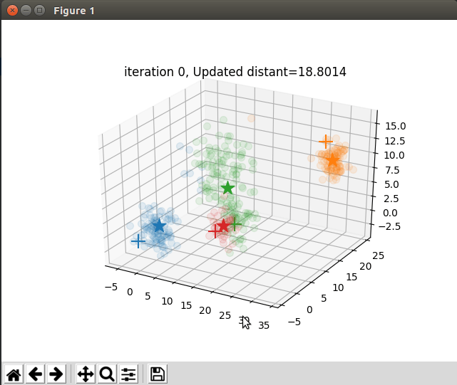

# NPTU AI Course

## K Nearest Neighbor and Iris KNN
### 2D

### 3D

## K Means
### 2D

### 3D

## Mean Shift
### 2D

### 3D

## Random Search
### 2D

### 3D

## Genetic Algorithm
### 2D

### 3D

## Reversed Ackley function optimization using GA

## Path Planning Using GA
### 2D

### 3D

